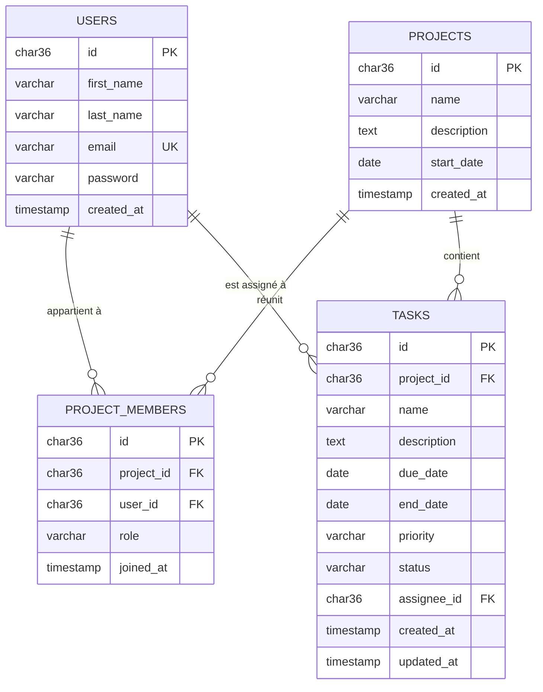

# Schéma de la base de données

Base `pmt_db` — MySQL 8.0, moteur InnoDB, jeu de caractères `utf8mb4`,
collation `utf8mb4_unicode_ci`.

Le script de génération correspondant est [`db/init/init.sql`](../../db/init/init.sql)
(structure **et** données de test).

## Modèle physique

## Les entités

### `users`

L'utilisateur de la plateforme.

| Colonne | Type | Contrainte | Rôle |
|---|---|---|---|
| `id` | `CHAR(36)` | `pk_users` | UUID généré côté application |
| `first_name` | `VARCHAR(250)` | `NOT NULL` | |
| `last_name` | `VARCHAR(250)` | `NOT NULL` | |
| `email` | `VARCHAR(250)` | `uk_users_email` | identifiant de connexion |
| `password` | `VARCHAR(250)` | `NOT NULL` | hachage BCrypt, 60 caractères |
| `created_at` | `TIMESTAMP` | `NOT NULL` | |

L'unicité de `email` est portée par un index, ce qui rend la recherche de
connexion immédiate. La collation `_ci` la rend insensible à la casse :
`Ron@pmt.fr` et `ron@pmt.fr` sont un doublon — le comportement attendu pour
des adresses e-mail.

### `projects`

Le projet, sans notion de propriétaire : c'est `project_members` qui porte
qui peut quoi.

| Colonne | Type | Contrainte |
|---|---|---|
| `id` | `CHAR(36)` | `pk_projects` |
| `name` | `VARCHAR(250)` | `NOT NULL` |
| `description` | `TEXT` | |
| `start_date` | `DATE` | `NOT NULL` |
| `created_at` | `TIMESTAMP` | `NOT NULL` |

### `project_members`

**La table centrale du modèle d'autorisation.** Elle associe un utilisateur à
un projet avec un rôle. Toute vérification de droit part d'ici.

| Colonne | Type | Contrainte |
|---|---|---|
| `id` | `CHAR(36)` | `pk_project_members` |
| `project_id` | `CHAR(36)` | `fk_members_project` → `projects(id)`, `ON DELETE CASCADE` |
| `user_id` | `CHAR(36)` | `fk_members_user` → `users(id)`, `ON DELETE CASCADE` |
| `role` | `VARCHAR(20)` | `ck_members_role` ∈ `ADMIN, MEMBER, OBSERVER` |
| `joined_at` | `TIMESTAMP` | `NOT NULL` |

La contrainte `uk_project_members (project_id, user_id)` interdit d'inscrire
deux fois la même personne sur un projet.

Le rôle est **par projet, pas global** : un même utilisateur peut être
administrateur du projet A et simple observateur du projet B.

| Rôle | Lire | Créer / modifier des tâches | Inviter, changer les rôles |
|---|:--:|:--:|:--:|
| `ADMIN` | ✅ | ✅ | ✅ |
| `MEMBER` | ✅ | ✅ | ❌ |
| `OBSERVER` | ✅ | ❌ | ❌ |

### `tasks`

| Colonne | Type | Contrainte |
|---|---|---|
| `id` | `CHAR(36)` | `pk_tasks` |
| `project_id` | `CHAR(36)` | `fk_tasks_project` → `projects(id)`, `ON DELETE CASCADE` |
| `name` | `VARCHAR(250)` | `NOT NULL` |
| `description` | `TEXT` | |
| `due_date` | `DATE` | échéance |
| `end_date` | `DATE` | date de fin réelle |
| `priority` | `VARCHAR(20)` | `ck_tasks_priority` ∈ `LOW, MEDIUM, HIGH` |
| `status` | `VARCHAR(20)` | `ck_tasks_status` ∈ `TODO, IN_PROGRESS, DONE` |
| `assignee_id` | `CHAR(36)` | `fk_tasks_assignee` → `users(id)`, `ON DELETE SET NULL` |
| `created_at` | `TIMESTAMP` | `NOT NULL` |
| `updated_at` | `TIMESTAMP` | renseignée à chaque modification |

Deux index accélèrent les accès les plus fréquents : `idx_tasks_project`
(lister les tâches d'un projet) et `idx_tasks_assignee` (retrouver les tâches
d'une personne).

## Choix techniques

**Clés primaires en `CHAR(36)`.** Les UUID sont générés par l'application, pas
par la base : l'identifiant est connu avant l'insertion, et rien ne fuit sur le
volume de données — contrairement à un auto-incrément.

L'entité JPA porte `@JdbcTypeCode(SqlTypes.CHAR)` : sans elle, Hibernate 6+
envoie l'UUID en binaire sur 16 octets et MySQL rejette l'insertion.

**Suppressions en cascade.** Supprimer un projet supprime ses membres et ses
tâches. Supprimer un utilisateur libère ses tâches (`SET NULL`) plutôt que de
les détruire : le travail reste, seule l'assignation disparaît.

**Contraintes `CHECK` sur les énumérations.** Les valeurs de `role`, `priority`
et `status` sont validées par la base autant que par l'application. Côté Java
elles sont mappées en `@Enumerated(EnumType.STRING)` — jamais `ORDINAL`, qui
décalerait silencieusement toutes les lignes existantes si l'on insérait une
valeur au milieu de l'énumération.

**`TIMESTAMP` et fuseau horaire.** MySQL stocke en UTC et reconvertit selon le
fuseau de la connexion, d'où le `serverTimezone` de l'URL JDBC. Les dates
métier (`start_date`, `due_date`, `end_date`) sont des `DATE` sans heure, donc
sans ambiguïté de fuseau.

## Données de test

`init.sql` crée quatre comptes — mot de passe commun `motdepasse123` — trois
projets, sept appartenances et neuf tâches.

| Compte | Rôles |
|---|---|
| `alice@pmt.fr` | ADMIN sur 2 projets, MEMBER sur 1 |
| `bob@pmt.fr` | ADMIN sur 1 projet, MEMBER sur 1 |
| `chloe@pmt.fr` | OBSERVER sur 2 projets |
| `mallory@pmt.fr` | **aucun projet** — sert à vérifier qu'un non-membre reçoit bien 404 |

Les hachages ont été **produits par l'API** via `POST /api/auth/register`, pas
écrits à la main : un hachage BCrypt fait exactement 60 caractères et ne
s'invente pas.
